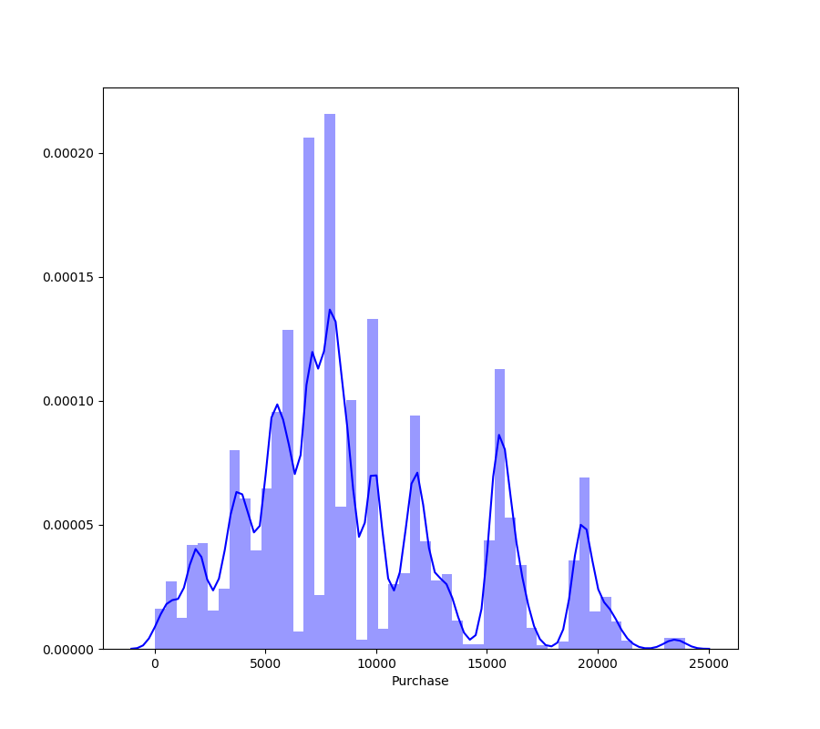
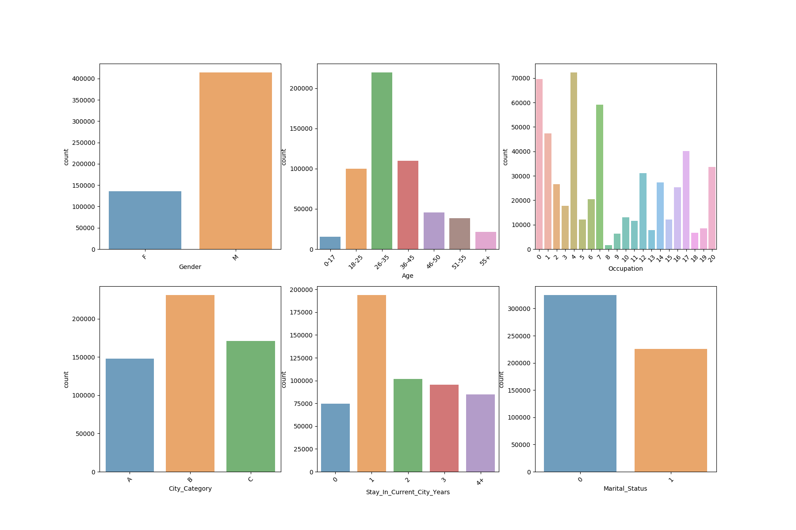

# black-friday-eda

My attempt on https://datahack.analyticsvidhya.com/contest/black-friday/  
  
I will start with exploratory data analysis
  
  
**Dataset overview**  
  
| Column name | Values | Unique | Type |
| --- | --- | --- | --- |
| User_ID | 550068 | 5891 | non-null int64 |
| Product_ID | 550068 | 3631 | non-null object |
| Gender | 550068 | 2 | non-null object |
| Age | 550068 | 7 | non-null object |
| Occupation | 550068 | 21 | non-null int64 |
| City_Category | 550068 | 3 | non-null object |
| Stay_In_Current_City_Years | 550068 | 5 | non-null object |
| Marital_Status | 550068 | 2 | non-null int64 |
| Product_Category_1 | 550068 | 20 | non-null int64 |
| Product_Category_2 | 376430 | 17 | non-null float64 |
| Product_Category_3 | 166821 | 15 | non-null float64 |
| Purchase | 550068 | 18105 | non-null int64 |

Total number of records is 550068. Missing values occur in product categories 2 and 3. As we can see there are only 5891 unique users, 7 age categories and 20 product categories.  
I will focus at Purchase column first.  
  
**Purchase variable**  
Predicting purchase value is the matter of the contest. It's the only continous variable in the set while the rest is categorical.  
Purchase distribution:  
  
  
As we can see the distribution doesn't fit any particular scheme. It is impossible to find any correlation due to lack of continous variables in the set.
  
**Categorical variables**  
I will take a look at categorical variables' counts.  
  
  
For each variable most purchases have been done by:  
- males  
- people aged 26-35  
- people who have been living in their current city for 1 year  
  
Occupation values are masked and we can only see there are some huge disproportions between their counts.  
  
**Boxplots**  
Next I will take a look at boxplots picturing correlation between Purchase and rest of variables  
![Gender]
![Marital_Status]
![Occupation]
![Stay_in_current_city_years]
![Product_Category_1]
![Product_Category_2]
![Product_Category_3]
